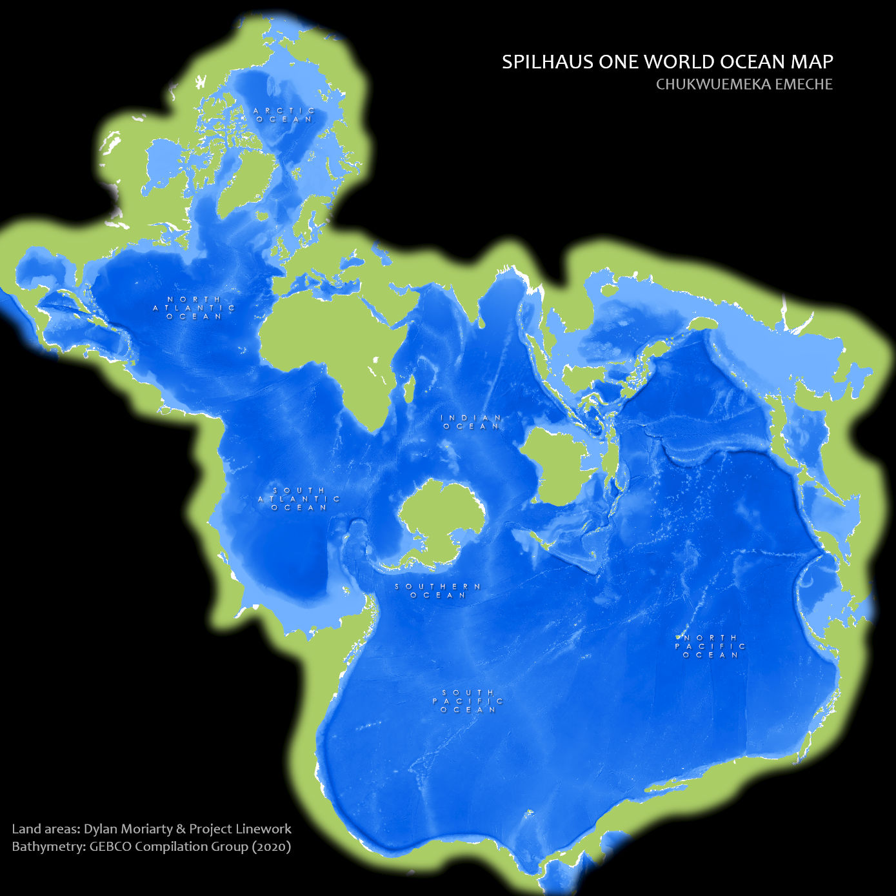

# SpilView: Seeing the World Through Oceans
A map featuring an unconventional yet visually striking projection of the world's oceans, designed to offer a fresh and innovative perspective on global marine geography. This creative approach challenges traditional map views, highlighting the interconnectedness and vastness of the world’s oceanic systems.

## How It's Made:

**Tech used:** ArcGIS Pro

The project began with a basic world map, drawn in the WGS84 coordinate system, with simple black and gray tones. It had a cartoonish level of generalization designed to balance detail and clarity on a small-scale map. The map felt flat, and I wanted it to tell a more dynamic story about the world’s oceans.

To bring this idea to life, I decided to use a different map projection that would emphasize the interconnectedness of the oceans. I chose the "Spilhaus World Ocean Map in a Square." This unique projection reimagines the world’s geography, presenting all the oceans as one continuous body of water. I zoomed to the full extent of the map, opened the Map Properties dialog box, and switched to the Spilhaus projection, instantly giving the map a fresh, ocean-centric perspective.

With the projection set, my next task was to create a layout that highlighted the oceans and framed them with an elegant border. I created a new layout with a custom page size of 1000x1000 points, providing a square canvas. I added the Spilhaus map to this layout and adjusted the map frame properties, removing the default border to allow the oceans to stretch across the canvas without interruption.

To ensure a seamless visual flow, I duplicated the map frame four times, positioning these duplicates along the edges of the central map. I carefully rotated each frame to align perfectly with the main map, creating a continuous, repeating pattern that maintained the geographic integrity of areas like the Gulf of Mexico. This approach gave the map a sense of unending oceanic continuity.

To draw the viewer’s eye toward the ocean, I added a vignette overlay image with a black mask, which created a soft, faded edge around the map. This effect added depth and contrast, subtly guiding attention to the center of the composition. 

Next, I began adding color to bring the map to life. I chose a vibrant green for the land polygons, which popped against the backdrop of blue tones I applied to represent the ocean depths. This color scheme enhanced the map's visual appeal while also conveying the information more effectively. Finally, I added titles, text, and other essential elements to complete the layout.

By the end, I had transformed a simple, monochromatic map into a captivating and informative depiction of the world’s oceans. This project taught me how a thoughtful choice of projection can shift a map’s narrative, how repetition can create a sense of continuity, and how color and overlays can be powerful tools in crafting an engaging visual story.

## Lessons Learned:

Through this project, I gained a wealth of valuable insights and skills. First and foremost, I learned the significance of choosing the right map projection to effectively convey a story—in this case, the interconnectedness of the world's oceans through the Spilhaus projection. This exercise underscored the transformative power of projections in altering perspectives and highlighting specific features.

Creating the layout taught me the importance of visual prioritization and the impact of thoughtful design elements like borders and frame adjustments. By duplicating and rotating map frames, I discovered techniques to maintain geographic continuity and avoid abrupt edges, enhancing the overall coherence of the map.

Adding a vignette overlay and experimenting with color schemes further emphasized the role of visual aesthetics in map design. These elements not only made the map more attractive but also helped focus the viewer's attention on key features. This process highlighted how color choices and overlays can significantly enhance a map's readability and engagement.

Finally, incorporating text, titles, and other details into the layout demonstrated the importance of clear communication in cartography. This project reinforced the need for meticulous attention to detail and creative design to transform a simple map into a compelling and informative visual story.

Overall, this experience deepened my understanding of advanced GIS techniques, the art of visual hierarchy, and the critical role of design in effective map-making.

## Examples:
Take a look at these couple examples that I have in my own portfolio:

**OsoShift:** [OsoShift: Oso Landslide Story](https://github.com/NomadCode33/NomadGeo/tree/main/CartoCraft/OsoShift)

**ImpactAtlas:** [ImpactAtlas: Climate Change Through Spatial Insight](https://github.com/NomadCode33/NomadGeo/tree/main/GreenMap%20Initiative/ImpactAtlas)

**EcoPulse Report:** [EcoPulse Climate Analysis Report](https://github.com/NomadCode33/NomadGeo/tree/main/EcoPulse/EcoPulse%20Climate%20Analysis%20Report)

## Repositories
**Profile:** [NomadCode33](https://github.com/NomadCode33)

**Cartography Repository:** [CartoCraft](https://github.com/NomadCode33/NomadGeo/tree/main/CartoCraft)

**Main Repository:** [NomadGeo](https://github.com/NomadCode33/NomadGeo)